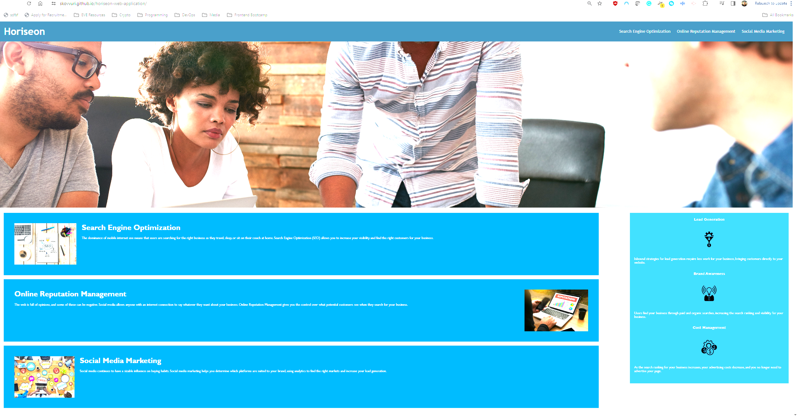
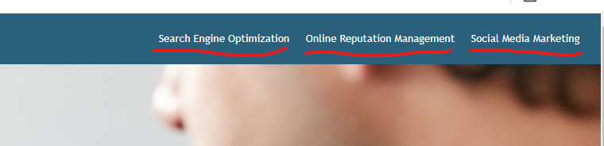

# horiseon-web-application
Code base for horiseon-web-application used by a marketing agency.  

## Table of Contents

* [Description](#description)
* [User Story](#user-story)
* [Acceptance Criteria](#acceptance-criteria)
* [Usage](#usage)

## Description 

This code base for horiseon-web-application used by a marketing agency.
The marketing agency needed to improve accessibility on there site and gave us the following general user-story

## User Story 
`AS A marketing agency.` 
`I WANT a codebase that follows accessibility standards.` 
`SO THAT our own site is optimized for search engines.` 

## Acceptance Criteria 
From our Acceptance Criteria i created several feature branches to encompass each Criterion.   

||
|--------------------------------------------------------------------------------|
|Semantic HTML elements can be found throughout the source code.                 |
||
|HTML elements follow a logical structure independent of styling and positioning.|
||
|Image and icon elements contain accessible alt attributes.                      |
||
|Heading attributes fall in sequential order.                                    |
||
|Title elements contain a concise, descriptive title.                            |

## Usage 

Link to view the deployed [horiseon site](https://skovvuri.github.io/horiseon-web-application/)

Click on any of the naviation links at the top to be directed to the right area.

© 2023 edX Boot Camps LLC. Confidential and Proprietary. All Rights Reserved.
